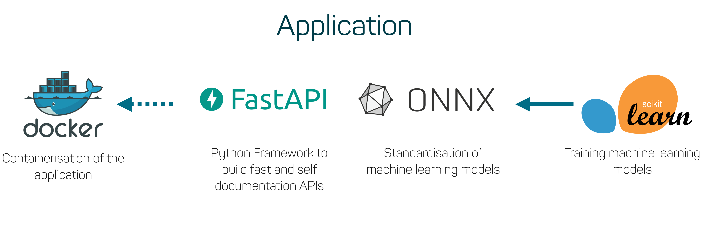
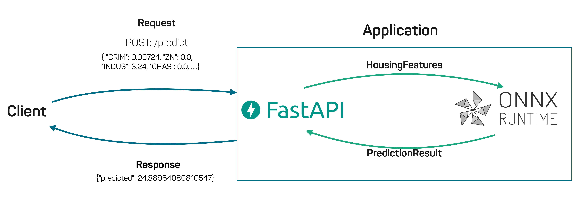

# scikit-onnx-fastapi-example

This repository shows how to serve a model with [ONNX Runtime](https://github.com/microsoft/onnxruntime) and [FastAPI](https://github.com/tiangolo/fastapi). 
A simple *linear regression* was trained with [scikit-learn](https://scikit-learn.org/) framework on the [boston housing dataset](https://scikit-learn.org/stable/modules/generated/sklearn.datasets.load_boston.html).

# Application Overview

The purpose of the application is to run the model with the ONNX Runtime and to use FastAPI to make the model available via a post request. We are using a token in headers request to secure the application.

## Structure

- [models/boston_housting.onnx](models/boston_housting.onnx): In the models folder we are storing the trained model. 
- [notebooks/Modeltraining.ipynb](notebooks/Modeltraining.ipynb): Here you can find the procedure that we are using to train the model.
- [application](application): Contains all of the code that we need to serve the model.

## Training
If you want to take a look on how the model was trained take a look into the [Modeltraining.ipynb](notebooks/Modeltraining.ipynb). 
After the training the model is exported to ONNX with the [skl2onnx](https://pypi.org/project/skl2onnx/) package.

## Deployment

Just run ``docker-compose up`` to start the project. 
- application is available at http://localhost
- docs are available at http://localhost/docs
- take a look on the [test.sh](test.sh) script to see an example for a prediction

## Application Visualisation
 